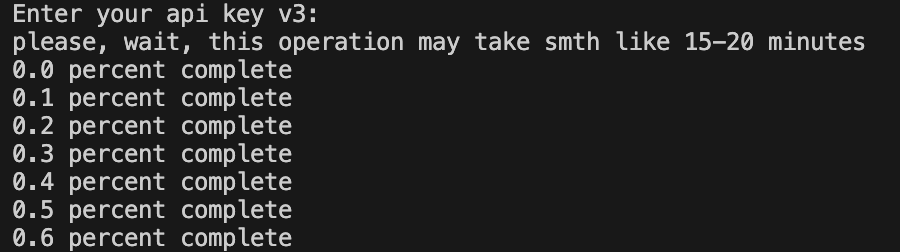
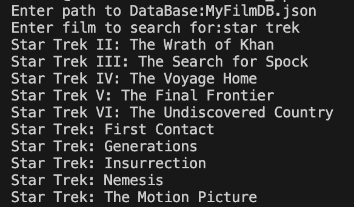
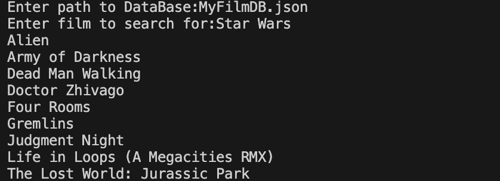

# tmdb_api

## Описание

Скрипты из репозитория [tmdb_api](https://github.com/devmanorg/tmdb_api) написаны для взаимодействия с сайтом [themoviedb](https://api.themoviedb.org).

## Основные и вспомогательные скрипты

Среди всех скриптов есть те, что запускаются в начале, и есть те, что запускаются после.

Какие-то из файлов вообще не предназначены для запуска (вспомогательные скрипты).

### Основные скрипты

- make_own_db.py
- find_similar.py
- search_in_db.py

### Вспомогательные скрипты

- hello_api_TMDB.py
- own_db_helpers.py
- tmdb_helpers.py

## Установка

Скачайте необходимые файлы, затем используйте `рір` (или `рірз` , если есть конфликт с Python2) для установки зависимостей. Используйте команду:

```
pip install -r requirements.txt
```

Для запуска скриптов у вас уже должен быть установлен Python, а также необходим api-ключ. Его можно получить на сайте [themoviedb](https://api.themoviedb.org)

## Описание каждого скрипта

### make_own_db.py

Данный скрипт скачивает собственную базу данных в формате json в файл `MyFilmDB.json`. По умолчанию база данных содержит в себе 1000 фильмов. Процесс может занять 15-20 минут. 

Для запуска используйте следующую команду в консоли:

```
python make_own_db.py
```

Сразу после запуска программа попросит вас ввести api-ключ.

Пример работы скрипта:


### search_in_db.py

Данный скрипт ищет все фильмы из базы данных, в которых содержится ключевое слово. Результатом работы программы является список подходящих названий фильмов (на языке оригинала)

Для запуска используйте следующую команду в консоли:

```
python search_in_db.py
```

В процессе работы программы требуется ввести путь к файлу с базой данных и ключевое слово. 

Пример работы скрипта:



### find_similar.py

Скрипт создает список фильмов, которые похожи на предложенный пользователем фильм. 

Самым важным параметром при поиске подходящих фильмов является коллекция, которой принадлежит фильм. Далее программа учитывает жанр и язык оригинала. В последнюю очередь обращается внимание на бюджет фильма. Фильм, изначально введенный пользователем, не будет предложен.

Для запуска используйте следующую команду в консоли:

```
python find_similar.py
```

В процессе работы программы требуется ввести путь к файлу с базой данных и ключевое слово. 

Пример работы скрипта:




